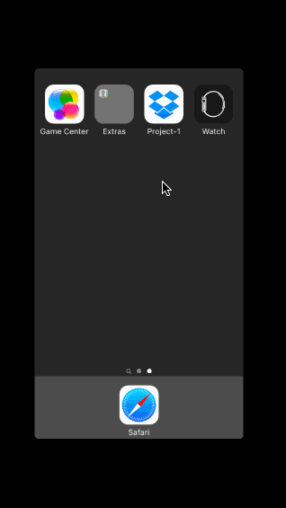

# Assignment 1: Dropbox for Codepath

The purpose of this homework is to use Xcode to implement the flow between the screens of an application. We're going to use the techniques from this week to implement the Dropbox app from the signed out state to the basic signed in state.

Time: I spent around 3-4 hours on the exercise

## What does the project can do?

* [x] Required: User can tap through the 3 welcome screens. 
* [x] Required: User can follow the create user flow.
* [x] Required: User can follow the sign in flow.
* [ ] Optional: Add a detail view for one of the files and implement favoriting the file.
* [ ] Optional: Add UITextFields for the forms so you can actually type in them and handle dismissing the keyboard.
* [ ] Optional: You should be able to swipe through the welcome screens instead of just tapping them.

Walkthrough of all the project stories:

The GIF was created with [LiceCap](http://www.cockos.com/licecap/).